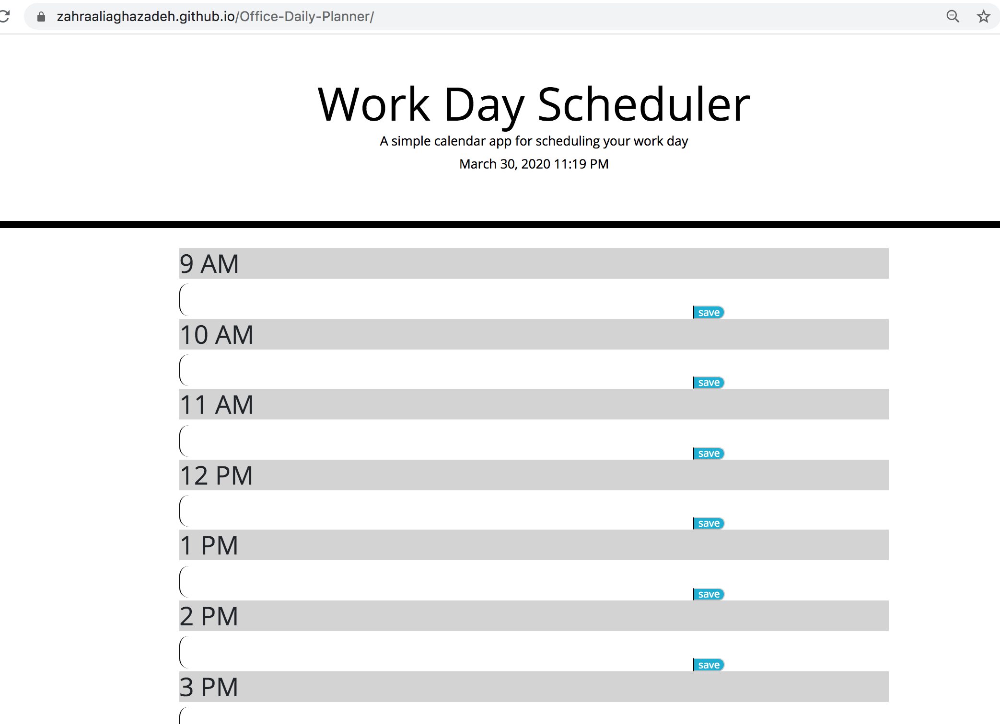

# office-Daily-Planner
> This application is a simple office daily planner with 9 time blocks. It can save the input in each time slot once you click the save button. In this colorcoded app, the past timeslot is gray , present is red and future is green. 

## Table of contents
* [General info](#general-info)
* [Screenshots](#screenshots)
* [Technologies/credit](#technologies/credit)
* [Setup](#setup)
* [Features](#features)
* [Status](#status)
* [Inspiration](#inspiration)
* [license](#license)
* [Contact](#contact)

## daily calendar with 9 time-blocks
In order to use this application you can open the link. 
This project let the user put in information in each time block to schedule their daily events which can be helpful. 

## Screenshots

## Technologies
* The time imported from [momentjs](https://momentjs.com/)
* Used [bootstrap](https://getbootstrap.com/)
* Used [fontawesome](https://fontawesome.com/) and [googlefonts](https://developers.google.com/fonts)
* The original CSS provided by [Triology](https://www.trilogyed.com/)

## Setup
To use this app you can click : [here](https://zahraaliaghazadeh.github.io/HW5/)

#### Areas of improvement?
It can improve in terms of its looks to look more like a planner.
The codes are repeated a lot and can be cleaned.

## Features
List of features ready and TODOs for future development
* feature 1 : color coded based on past present and future time slots. 
* feature 2 : ability to save in the local storage
* feature 3

To-do list:
* improvement to be done 1 : clean the code
* improvement to be done 2 : ability to save the text areas.
* improvement to be done 2 : css style needs improvement.
* wow improvement to be done 2 : posibibly making a calender that user will be able to drag and drop stickers onto the day.

## Status
Project is: _in progress_,

## Inspiration
As someone who always carries a calender, I liked to build the application to be able to improve it later as well.

#### Licence
MIT license
copy right © Zahra Ali Aghazadeh

## Contact
Email: zahraaliaghazadeh@gmail.com
LinkedIn: [LinkedIn](https://www.linkedin.com/in/yalda-aghazade-7a9b0390)

feel free to contact me!